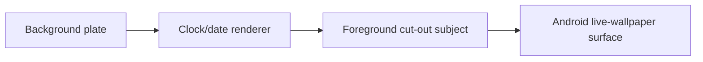

# Depth Wallpaper Feature Specification

**Application:** Creative Backgrounds  
**Scope:** Current Flutter Android Depth Wallpaper customization system  
**Audit basis:** Executable Dart/Kotlin source and repository tests  
**Dashboard status:** No Dashboard/admin implementation is present in this repository; Dashboard capability is **Unknown / Requires Dashboard Audit**.

> This is an implementation audit, not a feature proposal. Executable code wins over comments. Proposed Dashboard guidance is separated from the current mobile behavior.

## 1. Overview

A Depth Wallpaper consists of a background plate, an optional foreground cut-out subject, an optional backend-authored clock configuration, and an optional backend-authored foreground transform. User state is split into:

- `ClockConfigEntity`: clock appearance, typography, layout, color, effects, date/time, and position.
- `DepthConfigEntity`: only the user's per-wallpaper depth on/off choice and the resolved foreground capability flag.
- `DepthRenderConfig`: content-team-authored foreground placement/effects. It is not user-editable in the current app.

The canonical composition order is:



Painting the foreground last places the clock behind the subject.

## 2. Scope

Included: listing/detail gating, Customize state, clock styles/fonts/weights/layouts/colors/effects/date/time/position, backend mapping, Hive persistence, Flutter preview, MethodChannels, Android SharedPreferences, native rendering, ranges, defaults, fallbacks, and parity gaps.

Not present in the current Depth editor and not claimed as supported:

- Background brightness, saturation, contrast, dimming, crop, pan, or image scale controls.
- User-editable foreground scale/position, depth strength, subject-overlap controls, rotation, or letter spacing.
- Gradient clock colors.
- User-selectable date format or locale.
- User-editable shadow/glow/stroke colors, blur, offset, or intensity sliders.

## 3. Architecture summary

### 3.1 Content and detail flow

1. Explore/feed requests depth rows through `getDepthWallpapers()`.
2. `WallpaperModel.fromApiFeedItem()` retains `background`, `foreground`, `clockConfig`, and `depthConfig` when supplied.
3. Detail responses resolve `background` and `foreground` from explicit fields or `assets` (`BACKGROUND`, `FOREGROUND`). A depth wallpaper's `fullUrl` prefers `ORIGINAL`, otherwise the composed `thumbnail`, not the bare background plate.
4. `WallpaperModel.toEntity()` maps backend clock JSON with `RemoteClockConfigMapper` and depth JSON to `DepthRenderConfig`.
5. Customize is enabled only after detail data is loaded.
6. `ClockConfigLoaded` loads the per-wallpaper user override, otherwise the remote default, otherwise built-in defaults.
7. `DepthConfigLoaded` loads the per-wallpaper depth toggle. With no saved value, depth defaults on only when both depth layers are available.
8. The Customize view renders BLoC state live.
9. Apply reads both BLoC states, persists them, downloads required assets, serializes configs, and launches Android's live-wallpaper picker.

### 3.2 State owners

| Concern | State owner | Persistent model |
|---|---|---|
| Clock editor | `ClockBloc` / `ClockReady` | `ClockConfigEntity` -> `ClockConfigModel` |
| Depth toggle | `DepthBloc` / `DepthReady` | `DepthConfigEntity` |
| Tab selection | `CustomizeBloc` | none |
| Content-authored clock | `WallpaperEntity.remoteClockConfig` | backend `clockConfig` map |
| Content-authored foreground transform | `WallpaperEntity.depthRenderConfig` | backend `depthConfig` map |

Each editor control dispatches an event directly to `ClockBloc`; there is no separate Dashboard conversion layer in the mobile app.

## 4. Full feature inventory

### 4.1 Current editor controls

The current Depth Customize UI exposes 28 controls/settings:

| Area | Control | Actual behavior |
|---|---|---|
| Styles | Clock style | Selects one of 13 local styles and seeds a preset bundle. |
| Clock | Position | `Top`, `Center`, `Bottom`; selecting an anchor clears exact dragged position. |
| Clock | Direct drag | Writes normalized `customX`/`customY` in `[0,1]`. |
| Clock | Font | `Inter`, `Serif`, `Mono`, `Oswald`, `Archivo Black`, `Anton`. |
| Clock | Weight | Eight named weight presets, 200–900. |
| Clock | Width | Horizontal-only scale, 55–150%. |
| Clock | Layout | `Inline`, `Stacked`, `Compact`, `Offset`, `Poster`. |
| Clock | Colon | Shown by UI only for inline; effective only in split-color rendering (see findings). |
| Clock | Line Spacing | 50–200%; ignored by inline. |
| Clock | Minute Offset | -100% to +100%; only minute row in `Offset`. |
| Clock | Color Mode | `Single` or `Split`. |
| Clock | Single color | Curated swatches or custom HSV picker. |
| Clock | Hours color | Curated/custom; visible in split mode. |
| Clock | Minutes color | Curated/custom; visible in split mode. |
| Clock | Colon color | UI reaches `Hours` and `Minutes`; model/native also support `Custom`, but the current option list omits it. |
| Clock | Size | 24–320 logical pixels in the current slider. |
| Clock | Height | Vertical stretch 100–300%. |
| Clock | Opacity | 0–100%. |
| Clock | Shadow | On/off; fixed blur/offset, remote configs can add strength. |
| Clock | Glow | On/off; fixed two-layer color glow. |
| Clock | Stroke | On/off; width is separately adjustable. |
| Clock | Stroke Width | 0.5–20 logical pixels; only when Stroke is on. |
| Clock | 24-Hour | `HH:mm`/`HH:mm:ss` versus `h:mm`/`h:mm:ss`. |
| Clock | Date | Show/hide. |
| Clock | Date Position | `Above` or `Below`; only when Date is on. |
| Clock | Date Color | Curated/custom; visually falls back to time color when unset. |
| Clock | Date Size | 50–200% over derived date size; only when Date is on. |
| Clock | Seconds | Show/hide seconds. |
| Depth | Depth Effect | On/off only when type is `depth` and both layers are non-empty. |

### 4.2 Backend-authored capabilities carried by the mobile model

Clock enabled state, raw backend style/font identifiers, raw variable-font weight, scale multiplier, rotation, depth value, remote shadow strength, exact normalized coordinates, date defaults, schema version, foreground scale, foreground X/Y offsets, background blur, and foreground shadow strength are all represented in the model even when not exposed as editor controls.

## 5. Clock Style Catalog

Style selection is a seed operation, not a live binding. It changes only the fields described below and clears `remoteStyle`/`remoteFont` so the local style becomes authoritative.

| Display name | Internal id | Font | Weight | Dart spacing | Native spacing | Seeded layout | H-scale | Mode | Stroke | Stroke width | Fill mult. | Line spacing | Italic |
|---|---|---|---:|---:|---:|---|---:|---|---|---:|---:|---:|---|
| Modern | `modern` | Inter | 700 | -1 | -0.03 em | `inline` | 1.0 | `single` | off | 2 | 1.0 | 1.0 | no |
| Minimal | `minimal` | Inter | 300 | 3 | 0.10 em | `inline` | 1.0 | `single` | off | 2 | 1.0 | 1.0 | no |
| Elegant | `elegant` | PlayfairDisplay | 400 | 0 | 0 em | `inline` | 1.0 | `single` | off | 2 | 1.0 | 1.0 | yes |
| Digital | `digital` | JetBrainsMono | 700 | 1 | 0.04 em | `inline` | 1.0 | `single` | off | 2 | 1.0 | 1.0 | no |
| Condensed | `condensed` | Oswald | 600 | -0.5 | -0.02 em | `stacked` | 0.75 | `single` | off | 2 | 1.0 | 1.0 | no |
| Poster | `poster` | ArchivoBlack | 900 | -1 | -0.03 em | `stacked` | 1.0 | `single` | off | 2 | 1.0 | 1.0 | no |
| Outline | `outline` | Inter | 900 | 0 | 0 em | `inline` | 1.0 | `single` | on | 6 | 0.08 | 1.0 | no |
| Split | `split` | Inter | 800 | -0.5 | -0.02 em | `stacked` | 1.0 | `split` | off | 2 | 1.0 | 1.0 | no |
| Futuristic | `futuristic` | Anton | 400 | 1.5 | 0.05 em | `inline` | 1.0 | `single` | off | 2 | 1.0 | 1.0 | no |
| Editorial | `editorial` | ArchivoBlack | 900 | -0.5 | -0.02 em | `inline` | 1.0 | `single` | off | 2 | 1.0 | 1.0 | no |
| Monument | `monument` | Oswald | 700 | -1 | -0.03 em | `verticalPoster` | 0.70 | `single` | off | 2 | 1.0 | 0.7 | no |
| Stencil | `stencil` | Anton | 400 | 2 | 0.08 em | `inline` | 1.0 | `single` | off | 2 | 1.0 | 1.0 | no |
| Soft | `soft` | Inter | 500 | 0 | 0 em | `inline` | 1.0 | `single` | off | 2 | 1.0 | 1.0 | no |

Notes:

- Dart spacing is logical pixels; native spacing is Android `Paint.letterSpacing` em-fraction.
- Presets do not seed size, opacity, shadow, glow, color, date visibility/position/color/size, rotation, stretch, or exact position.
- `Outline` is style metadata plus `showStroke=true` and fill multiplier `0.08`, not a separate native mode.
- Style cards are simplified previews: inline, single-color, no date, no stroke/effects, and `sizePx=30`.

Per-style defaults not shown as separate table columns are shared: opacity `1.0`, shadow on, glow off, date on below with `dateColor=null` and `dateScale=1.0`, stroke width `2` unless the style seeds Outline's `6`, and colon enabled. Every style has the same hour/minute glyph size relationship because there are no separate hour/minute size fields. Non-inline seeded styles use equal-sized hour/minute rows; style selection does not prevent later layout, split-color, effect, date, or typography overrides. The styles with special seeded behavior are `Condensed` (stacked, X scale 0.75), `Poster` (stacked), `Outline` (stroke and reduced fill), `Split` (stacked and split color mode), and `Monument` (vertical-poster, X scale 0.70, line spacing 0.70). The `colon` default is visually relevant only to inline split-color rendering; non-inline layouts have no colon.

Style descriptions and compatibility: `Modern` is the default balanced Inter clock; `Minimal` is light with expanded tracking; `Elegant` is italic serif; `Digital` is bold monospace; `Condensed` is a narrow stacked treatment; `Poster` is a heavy stacked display; `Outline` is a heavy outlined treatment; `Split` is a stacked two-color treatment; `Futuristic` uses Anton with expanded tracking; `Editorial` is a heavy Archivo Black inline treatment; `Monument` is a narrow vertical-poster treatment; `Stencil` uses Anton with expanded tracking; and `Soft` is medium Inter. All styles support user overrides after selection, and all can be changed to split mode by the editor. Only `Split` seeds split mode, and only `Outline` seeds stroke. No style has a separate hour/minute size relationship, custom colon rule, or date behavior beyond the shared defaults above.

## 6. Time Layout Catalog

| UI name | Internal id | Rendering behavior | Example |
|---|---|---|---|
| Inline | `inline` | One visual line. | `12:45` |
| Stacked | `stacked` | Hour/minute rows with base gap `8 * displayScale`. | `12`<br>`45` |
| Compact | `stackedCompact` | Two rows with base gap `2 * displayScale`. | `12`<br>`45` |
| Offset | `offsetStack` | Two rows with base gap `8 * displayScale`; minute row gets `minuteOffsetX`. | `12`<br>`  45` |
| Poster | `verticalPoster` | Two rows with zero base gap; no other poster transform. | `12`<br>`45` |

All non-inline layouts render two rows and never show a colon. `lineSpacing` multiplies the base gap. Split mode colors hour/minute independently in all layouts; split inline additionally colors the colon. `splitTimeParts()` splits at the first `:` and keeps any seconds with the minute portion. Any layout can be selected after any style.

## 7. Typography controls

### 7.1 Font catalog

| UI label | Canonical value | Flutter family | Android asset |
|---|---|---|---|
| Inter | `inter` | `Inter` | `Inter-Variable.ttf` |
| Serif | `serif` | `PlayfairDisplay` | `PlayfairDisplay-Variable.ttf` |
| Mono | `mono` | `JetBrainsMono` | `JetBrainsMono-Variable.ttf` |
| Oswald | `oswald` | `Oswald` | `Oswald-Variable.ttf` |
| Archivo Black | `archivoBlack` | `ArchivoBlack` | `ArchivoBlack-Regular.ttf` |
| Anton | `anton` | `Anton` | `Anton-Regular.ttf` |

Remote font names containing `playfair`, `serif`, `georgia`, `times`, or `merriweather` map to Serif; names containing `mono`, `jetbrains`, `courier`, or `code` map to Mono; all other names map to Inter. The raw input is preserved in `remoteFont`.

### 7.2 Named weight catalog

| UI label | Canonical value | Weight int |
|---|---|---:|
| Extra Light | `extraLight` | 200 |
| Light | `light` | 300 |
| Regular | `regular` | 400 |
| Medium | `medium` | 500 |
| Semi Bold | `semiBold` | 600 |
| Bold | `bold` | 700 |
| Extra Bold | `extraBold` | 800 |
| Black | `black` | 900 |

Local-only configs use `fontWeightPreset`; remote-authored configs use raw `weight`. The current UI can change the named weight on a remote config, but both renderers use raw `weight` while `isRemote` remains true. Picking a style first clears remote authorship.

### 7.3 Width, height, and letter spacing

`horizontalScale` scales only X around the block center (`0.55–1.50`, default `1.0`). `stretchY` scales only Y from the glyph top (`1.0–3.0`, default `1.0`). `sizePx` is uniform text size (`24–320` editor range, default `65`). Letter spacing has no editor field or stored field; it is derived from the selected style preset.

## 8. Color system

### 8.1 Modes and slots

| Mode | Active fields | Behavior |
|---|---|---|
| `single` | `color` | One time color; split slots are ignored. |
| `split` | `hoursColor`, `minutesColor`, `colonColor`, optional `colonColorCustom` | Independent hour/minute and inline-colon colors. Missing hour/minute colors fall back to `color`. |

Date uses `dateColor` or falls back to `color`. Stroke is black. Glow uses the effective glyph color. Shadow is black.

### 8.2 Preset color catalog

All current swatches are opaque ARGB values. The original four are retained in this list for old selections.

| Name | HEX | ARGB int |
|---|---|---|
| Pure White | `#FFFFFF` | `0xFFFFFFFF` |
| Soft White | `#F5F5F5` | `0xFFF5F5F5` |
| Light Gray | `#D9D9D9` | `0xFFD9D9D9` |
| Silver | `#C0C0C0` | `0xFFC0C0C0` |
| Medium Gray | `#9AA6B2` | `0xFF9AA6B2` |
| Charcoal | `#36393F` | `0xFF36393F` |
| Black | `#111111` | `0xFF111111` |
| Red | `#E53935` | `0xFFE53935` |
| Bright Red | `#FF1744` | `0xFFFF1744` |
| Crimson | `#DC143C` | `0xFFDC143C` |
| Burgundy | `#800020` | `0xFF800020` |
| Coral | `#FF7F6E` | `0xFFFF7F6E` |
| Orange | `#FF7A00` | `0xFFFF7A00` |
| Deep Orange | `#E65100` | `0xFFE65100` |
| Amber | `#FFC107` | `0xFFFFC107` |
| Copper | `#B87333` | `0xFFB87333` |
| Yellow | `#FFEB3B` | `0xFFFFEB3B` |
| Gold | `#FFD700` | `0xFFFFD700` |
| Warm Gold | `#E1B12C` | `0xFFE1B12C` |
| Lemon | `#FFF44F` | `0xFFFFFF4F` |
| Lime | `#CDDC39` | `0xFFCDDC39` |
| Green | `#43A047` | `0xFF43A047` |
| Emerald | `#50C878` | `0xFF50C878` |
| Mint | `#98FF98` | `0xFF98FF98` |
| Teal | `#00897B` | `0xFF00897B` |
| Cyan | `#00E5FF` | `0xFF00E5FF` |
| Sky Blue | `#87CEEB` | `0xFF87CEEB` |
| Blue | `#2196F3` | `0xFF2196F3` |
| Royal Blue | `#4169E1` | `0xFF4169E1` |
| Navy | `#001F54` | `0xFF001F54` |
| Purple | `#9C27B0` | `0xFF9C27B0` |
| Violet | `#8F00FF` | `0xFF8F00FF` |
| Indigo | `#4B0082` | `0xFF4B0082` |
| Lavender | `#E6E6FA` | `0xFFE6E6FA` |
| Pink | `#F48FB1` | `0xFFF48FB1` |
| Hot Pink | `#FF69B4` | `0xFFFF69B4` |
| Rose | `#E0BFB8` | `0xFFE0BFB8` |
| Magenta | `#FF00FF` | `0xFFFF00FF` |
| Warm Cream | `#E7D9BE` | `0xFFE7D9BE` |

### 8.3 Custom color behavior

The picker is a Flutter HSV saturation/value area plus a 0–360° hue slider. It updates preview live and restores the original color on cancel. Storage is an ARGB `int`; API colors are CSS `#RRGGBB` or `#RRGGBBAA`. There is no alpha slider. Custom colors are reachable for base, hours, minutes, and date; the colon custom model/native path exists but the normal UI cannot select it.

## 9. Effects

### 9.1 Clock effects

| Effect | Current behavior |
|---|---|
| Shadow | Black, blur `8`, offset `(0,4)`; local alpha about 0.54/140; remote strength modulates alpha. Date shadow uses blur `6`, offset `(0,2)`. |
| Glow | Flutter uses color shadows blur `24` alpha `0.9` and blur `40` alpha `0.6`; native uses one outer blur `24` approximation. |
| Stroke | Black stroke drawn before fill, per row. Default width `2`; Outline seeds `6`. |
| Opacity | Applies to clock/date; Outline additionally multiplies time fill by `0.08`. |

No controls exist for effect colors, blur, offset, or intensity beyond the toggles, opacity, stroke width, and remote clock shadow strength.

### 9.2 Backend depth effects

`DepthRenderConfig` contains `foregroundScale`, normalized `foregroundOffsetX/Y`, background `blurRadius`, and foreground `shadowStrength`. Flutter applies background blur and foreground shadow. Android applies background blur only on API 31+ and currently ignores foreground `shadowStrength` in `DepthCompositor.drawForeground()`.

## 10. Date/time options

Time formats are `h:mm`, `HH:mm`, `h:mm:ss`, or `HH:mm:ss`, controlled by `is24Hour` and `showSeconds`. Date format is fixed to `EEEE, MMMM d`, using device/default locale in the Depth Customize and final live-wallpaper paths. There is no date-format, case, or locale selector.

Date fields: `showDate` default `true`, `datePosition` (`above`/`below`, default `below`), nullable `dateColor`, and `dateScale` (`0.5–2`, default `1`). Base date size is `(sizePx * 0.22).clamp(14,24)` multiplied by `dateScale`.

## 11. Position and normalized units

| UI label | Value | Raw anchor calculation |
|---|---|---|
| Top | `top` | `height * 0.16` |
| Center | `center` | `(height - blockHeight)/2` |
| Bottom | `bottom` | `height * 0.74 - blockHeight` |

Dragging stores `customX`/`customY` as the clock center normalized to `[0,1]`. Exact coordinates win only when both are non-null; selecting an anchor clears them. The Flutter and Kotlin renderers clamp the rotated AABB of the complete block, including date, stretch, horizontal scale, and remote rotation. If an axis is too large to fit, it is centered.

Rotation is backend-only (`-180–180°`), pivots around the clock block center, and is rendered only for remote-authored configs.

## 12. Depth compositing

`WallpaperEntity.supportsDepth` requires `type == depth`, a non-empty background URL, and a non-empty foreground URL. `hasForegroundMask` alone is insufficient. Unsupported toggles are disabled and an enable attempt emits `DepthNotSupported`.

| Layer | Source | Affecting settings |
|---|---|---|
| Background plate | `backgroundUrl`, else `fullUrl` | `depthConfig.blurRadius`, cover crop |
| Clock/date | `ClockConfigEntity` | All clock fields except unused `depth` |
| Foreground subject | `foregroundMaskUrl` | Scale, normalized offsets, intended shadow |

There are no user controls for foreground geometry or depth strength. The actual depth order is fixed by `BACKGROUND -> CLOCK -> FOREGROUND`.

## 13. Numeric ranges and defaults

### 13.1 Editor controls

| Field | Min | Max | Default | Step/storage/UI |
|---|---:|---:|---:|---|
| `sizePx` | 24 | 320 | 65 | continuous, `double`, logical px |
| `horizontalScale` | 0.55 | 1.50 | 1.0 | continuous, `double`, 55–150% |
| `stretchY` | 1.0 | 3.0 | 1.0 | continuous, `double`, 100–300% |
| `opacity` | 0 | 1 | 1.0 | continuous, `double`, 0–100% |
| `lineSpacing` | 0.5 | 2.0 | 1.0 | continuous, `double`, 50–200% |
| `minuteOffsetX` | -1 | 1 | 0 | continuous, `double`, -100–100% |
| `strokeWidth` | 0.5 | 20 | 2 | continuous, `double`, logical px |
| `dateScale` | 0.5 | 2.0 | 1.0 | continuous, `double`, 50–200% |
| `customX/Y` | 0 | 1 | null | drag frames, nullable `double`, normalized |

`LabeledSlider` sets no `divisions`, so no source-defined numeric increment exists. Labels are rounded for display only.

### 13.2 Backend/native ranges

| Field | Min | Max | Default | Notes |
|---|---:|---:|---:|---|
| `weight` | 100 | 900 | 400 | Native/remote mapper clamp |
| `scale` | 0.5 | 3 | 1 | Remote derives `sizePx=76*scale`, clamped 24–120 |
| `rotation` | -180 | 180 | 0 | Remote-only effective |
| `depth` | 0 | 1 | 0.45 | Persisted but unused |
| clock `shadowStrength` | 0 | 1 | 0.5 | Meaningful with remote shadow |
| `foregroundScale` | 0.5 | 3 | 1 | Backend depth config |
| foreground offsets | -1 | 1 | 0 | Normalized fractions |
| `blurRadius` | 0 | 100 | 0 | Background blur |
| depth `shadowStrength` | 0 | 1 | 0 | Native currently ignores |

Discrepancies: the entity's old `sizePx` comment says 24–120 while the active slider allows 24–320; editor line spacing is 0.5–2 while native accepts 0–3; `ClockConfigModel` does not clamp all local numeric fields.

## 14. Complete configuration model

### 14.1 `ClockConfigEntity`

| Field | Dart type/default | Nullable | Meaning / renderer status |
|---|---|---:|---|
| `style` | `ClockStyle.modern` | no | 13-style selector; Flutter/native |
| `position` | `ClockPosition.top` | no | Anchor; Flutter/native |
| `font` | `ClockFont.inter` | no | 6 bundled fonts; Flutter/native |
| `color` | `int 0xFFFFFFFF` | no | Base time color |
| `sizePx` | `double 65` | no | Uniform text size |
| `opacity` | `double 1` | no | Clock/date alpha |
| `showShadow` | `bool true` | no | Clock/date shadow toggle |
| `showGlow` | `bool false` | no | Clock glow toggle; native approximate |
| `showStroke` | `bool false` | no | Stroke toggle |
| `is24Hour` | `bool false` | no | 12/24-hour format |
| `showDate` | `bool true` | no | Date visibility |
| `showSeconds` | `bool false` | no | Seconds visibility |
| `enabled` | `bool true` | no | Backend may disable clock |
| `remoteStyle` | `String? null` | yes | Raw backend style; authorship marker |
| `remoteFont` | `String? null` | yes | Raw backend font; authorship marker |
| `weight` | `int 400` | no | Remote variable weight, 100–900 |
| `scale` | `double 1` | no | Remote multiplier retained; size is derived |
| `rotation` | `double 0` | no | Remote degrees, -180–180 |
| `depth` | `double 0.45` | no | Persisted/mapped but unused |
| `shadowStrength` | `double 0.5` | no | Remote clock shadow strength, 0–1 |
| `datePosition` | `ClockDatePosition.below` | no | `above`/`below` |
| `dateColor` | `int? null` | yes | Date color, null -> base color |
| `customX/Y` | `double? null` | yes | Exact normalized position, 0–1 |
| `schemaVersion` | `int 1` | no | Forward-compat marker, no visual behavior |
| `stretchY` | `double 1` | no | Local vertical scale, 1–3 |
| `dateScale` | `double 1` | no | Date size multiplier, 0.5–2 |
| `fontWeightPreset` | `ClockWeight.regular` | no | Local named weight |
| `horizontalScale` | `double 1` | no | Local horizontal scale, 0.55–1.5 |
| `timeLayout` | `ClockTimeLayout.inline` | no | Five time layouts |
| `showColon` | `bool true` | no | Effective only split-inline; single-inline mismatch |
| `lineSpacing` | `double 1` | no | Stacked gap multiplier |
| `minuteOffsetX` | `double 0` | no | Offset-layout minute translation |
| `colorMode` | `ClockColorMode.single` | no | Single/split |
| `hoursColor` | `int? null` | yes | Split hour color |
| `minutesColor` | `int? null` | yes | Split minute color |
| `colonColor` | `ClockColonColor.hours` | no | Split-inline colon source |
| `colonColorCustom` | `int? null` | yes | Custom split-inline colon color |
| `strokeWidth` | `double 2` | no | Stroke width, 0.5–20 |

### 14.2 Depth models

`DepthConfigEntity` fields are `wallpaperId:String` (required Hive scope), `enabled:bool` (default false), and `hasForegroundMask:bool` (default false). Its JSON contains only `enabled` and `hasForegroundMask`.

`DepthRenderConfig` fields are `foregroundScale:double=1`, `foregroundOffsetX:double=0`, `foregroundOffsetY:double=0`, `blurRadius:double=0`, and `shadowStrength:double=0`.

## 15. Current serialization

### 15.1 Backend API shape

`WallpaperModel` stores nested `clockConfig` and `depthConfig` maps verbatim. The current mapper reads:

```json
{
  "clockConfig": {
    "enabled": true,
    "style": "thin",
    "position": "custom",
    "customX": 0.42,
    "customY": 0.18,
    "font": "Inter",
    "weight": 650,
    "scale": 1.15,
    "rotation": -4,
    "color": "#FFFFFFCC",
    "opacity": 0.9,
    "depth": 0.45,
    "shadow": {"enabled": true, "strength": 0.6},
    "date": {"enabled": true, "position": "below", "color": "#FFFFFF"},
    "schemaVersion": 1
  },
  "depthConfig": {
    "foregroundScale": 1.15,
    "foregroundOffsetX": -0.04,
    "foregroundOffsetY": 0.08,
    "blurRadius": 12,
    "shadowStrength": 0.7
  }
}
```

Remote fallback mapping: `minimal`/`thin` -> minimal; `classic` -> elegant; `solid`/`bold`/`rounded`/`outlined`/`modern` -> modern; unknown -> modern. `position=custom` resolves the UI anchor from `customY` but preserves exact coordinates. Remote CSS colors are converted to ARGB.

### 15.2 Local/Hive clock JSON

`ClockConfigModel.toJson()` emits one flat object with all fields and Dart enum names. It is JSON-encoded as a string in Hive box `clock_config`, key `wallpaper:<wallpaperId>`.

```json
{
  "style":"modern","position":"top","font":"inter","color":4294967295,
  "sizePx":65.0,"opacity":1.0,"showShadow":true,"showGlow":false,
  "showStroke":false,"is24Hour":false,"showDate":true,"showSeconds":false,
  "enabled":true,"remoteStyle":null,"remoteFont":null,"weight":400,
  "scale":1.0,"rotation":0.0,"depth":0.45,"shadowStrength":0.5,
  "datePosition":"below","dateColor":null,"customX":null,"customY":null,
  "schemaVersion":1,"stretchY":1.0,"dateScale":1.0,"fontWeightPreset":"regular",
  "horizontalScale":1.0,"timeLayout":"inline","showColon":true,"lineSpacing":1.0,
  "minuteOffsetX":0.0,"colorMode":"single","hoursColor":null,"minutesColor":null,
  "colonColor":"hours","colonColorCustom":null,"strokeWidth":2.0
}
```

### 15.3 MethodChannel/native format

Clock JSON is sent as a string through `com.backgrounds.trend4k/clock`, method `saveClockConfig`, and stored in SharedPreferences `clock_prefs`, key `clock_config_json`. Apply carries the same string as the `clockConfig` argument of `applyWallpaper`.

Depth JSON is a separate string with the five `DepthRenderConfig` keys and is stored as `depth_config_json`. Null means identity defaults. The Apply envelope also includes `imagePath`, `destination`, `depthEnabled`, `maskPath`, and `isLive`.

The local Dart JSON and the Android parser are forward-compatible but not structurally identical: Android `ClockConfig.fromJson()` reads the flat fields it declares and ignores unknown keys. In particular, Android does not declare/read the Dart entity's `scale` or `depth` fields; `sizePx` is the effective native size and `depth` has no renderer effect. The Android parser also applies its own clamps for several fields, so Dashboard validation must use the documented mobile/editor ranges rather than assuming every Dart default/model range is enforced identically on-device.

## 16. Default configuration

The effective no-override/no-remote clock default is the JSON in section 15.2: Modern, Top, Inter, opaque white, size 65, opacity 1, shadow on, glow/stroke off, 12-hour, date on below, inline, colon on, single color, no custom position, and all identity multipliers.

Depth defaults are `enabled=true` and `hasForegroundMask=true` only for a compositable depth wallpaper; render defaults are scale 1, offsets 0, blur 0, shadow 0.

## 17. Conditional UI and dependencies

| Condition | UI | Renderer |
|---|---|---|
| `timeLayout == inline` | Show colon; hide line spacing/offset | Inline; colon currently effective only split mode |
| `timeLayout != inline` | Show line spacing | Two rows; colon always hidden |
| `timeLayout == offsetStack` | Show minute offset | Shift second row only |
| `colorMode == split` | Show hours/minutes; show colon color if inline | Independent segment/row colors |
| `showStroke` | Show stroke width | Stroke pass behind fill |
| `showDate` | Show date position/color/size | Date contributes to bounds |
| Both `customX` and `customY` non-null | Exact position is in force | Exact normalized center wins |
| Unsupported depth | Toggle disabled/snackbar | Foreground omitted |
| Manual style selection | Clears remote authorship | Local preset becomes effective |

## 18. Persistence and precedence

Clock precedence is exactly:

```text
per-wallpaper user override > wallpaper remote default > built-in defaults
```

There is no global clock override layer. Clock reset deletes the Hive override and returns to remote/built-in config. Corrupt clock JSON is treated as absent. Depth uses box `depth_config`, raw wallpaper id, and only the two boolean fields; corrupt/missing data is treated as absent.

Apply dispatches save events before opening the apply sheet but does not await those events; the apply operation uses the already captured in-memory BLoC values.

## 19. Rendering pipeline

### 19.1 Flutter

`DepthLayerStack` paints background (cover), optional `ImageFilter.blur`, `ClockRendererWidget`/`ClockPainter`, then foreground (normalized translation and scale). Full Customize preview derives aspect ratio from `MediaQuery` and uses a display scale; the small `DepthPreviewWidget` is 16:10 and halves clock size.

### 19.2 Android

`LiveWallpaperService` loads persistent assets, parses `DepthConfig`, optionally blurs the background once on API 31+, then each visible tick draws cover-cropped background, `ClockRenderer`, and foreground last. Clock sizes are Flutter logical pixels multiplied by Android display density. The service ticks once per second while visible.

### 19.3 Apply

For depth enabled, Flutter downloads the background plate and foreground mask to the app support directory, never the flattened original as the base. Android persists paths/config and launches `ACTION_CHANGE_LIVE_WALLPAPER`.

## 20. Editor/renderer support matrix

Legend: `✓` supported; `B` backend-only; `I` indirect; `~` approximate; `⚠` mismatch; `✗` unsupported.

| Feature | Editor | Persisted | Preview | Final renderer | Notes |
|---|---:|---:|---:|---:|---|
| Style/font/position/size/width/height | ✓ | ✓ | ✓ | ✓ | Shared geometry/presets |
| Named weight | ✓ | ✓ | ✓ local | ✓ local | ⚠ ignored while remote |
| Remote weight/rotation | B | ✓ | ✓ | ✓ | Only when remote |
| Five layouts | ✓ | ✓ | ✓ | ✓ | Shared layout engine |
| Colon visibility | ✓ | ✓ | ⚠ | ⚠ | Single inline always includes `:` |
| Line spacing/offset | conditional | ✓ | ✓ | ✓ | Layout-dependent |
| Single/split colors | ✓ | ✓ | ✓ | ✓ | Split slots fallback to base |
| Custom colon color | model path | ✓ | ✓ | ✓ | UI option missing |
| Opacity/shadow/glow/stroke | ✓ | ✓ | ✓ | ~ | Native glow approximation |
| Date/time | ✓ | ✓ | ✓ | ✓ | Fixed format/device locale |
| Clock `depth` | ✗ | ✓ | ✗ | ✗ | Implemented but unused |
| Depth toggle | ✓ | ✓ | ✓ | ✓ | Capability-gated |
| Foreground scale/offset/blur | B | API only | ✓ | ✓ API>=31 blur | Not user-editable |
| Foreground shadow strength | B | API only | ✓ | ⚠ no | Native draw ignores it |
| Image controls/gradients | ✗ | ✗ | ✗ | ✗ | Not current features |

## 21. Backward compatibility

Missing newer local fields use identity/default values: `fontWeightPreset=regular`, `horizontalScale=1`, `timeLayout=inline`, `showColon=true`, `lineSpacing=1`, `minuteOffsetX=0`, `colorMode=single`, split colors null, `colonColor=hours`, custom colon null, and `strokeWidth=2`. Unknown keys are ignored. Invalid local blobs are treated as absent.

Missing API clock/depth maps use remote/built-in and identity depth defaults. Bad remote numbers are clamped where the mapper defines ranges. CSS `#RRGGBBAA` must remain CSS byte order. Current remote mapper ignores newer editor keys such as `timeLayout`, `colorMode`, `stretchY`, `dateScale`, and `strokeWidth`.

## 22. Mobile-only vs server-controlled

| Classification | Current fields |
|---|---|
| Dashboard/API suitable | Remote clock fields, all depth render fields, and newer editor fields only after mobile remote ingestion supports them |
| User-only in current app | Local weight preset, horizontal/vertical scales, layouts, colon/split colors, stroke width, 12/24-hour, seconds, and local edits |
| Runtime/device-specific | Device time/locale, Android density, surface dimensions, preview scale, API level |
| Renderer/internal | Authorship markers, schema marker, bounds math, asset paths, capability snapshot |

Use normalized coordinates; never send device pixels. Sizes/effect lengths are authored logical pixels and density-converted natively.

## 23. Canonical Dashboard Values

| UI label | Canonical value |
|---|---|
| Styles | `modern`, `minimal`, `elegant`, `digital`, `condensed`, `poster`, `outline`, `split`, `futuristic`, `editorial`, `monument`, `stencil`, `soft` |
| Fonts | `inter`, `serif`, `mono`, `oswald`, `archivoBlack`, `anton` |
| Positions | `top`, `center`, `bottom`, `custom` |
| Layouts | `inline`, `stacked`, `stackedCompact`, `offsetStack`, `verticalPoster` |
| Color mode | `single`, `split` |
| Colon color | `hours`, `minutes`, `custom` |
| Date position | `above`, `below` |
| Weight presets | `extraLight`, `light`, `regular`, `medium`, `semiBold`, `bold`, `extraBold`, `black` |

Existing remote values `thin`, `classic`, `solid`, `bold`, `rounded`, and `outlined` are not interchangeable with these local ids; they are compatibility inputs to the current mapper.

## 24. Dashboard ↔ Mobile Configuration Contract

The shorter handoff in [`DEPTH_WALLPAPER_DASHBOARD_CONTRACT.md`](./DEPTH_WALLPAPER_DASHBOARD_CONTRACT.md) separates the current API shape from the recommended unified contract. Adding unknown keys is JSON-compatible, but the current `RemoteClockConfigMapper` ignores newer remote clock keys.

## 25. File/code reference map

| Capability | Primary implementation |
|---|---|
| Entity/enums | `lib/features/clock/domain/entities/clock_config_entity.dart` |
| Style presets | `lib/features/clock/domain/entities/clock_style_preset.dart` |
| Local/native JSON | `lib/features/clock/data/models/clock_config_model.dart`, `clock_config_model.g.dart` |
| Remote mapper | `lib/features/clock/data/models/remote_clock_config_mapper.dart` |
| Clock precedence | `lib/features/clock/data/repositories/clock_repository_impl.dart` |
| Clock events/state | `lib/features/clock/presentation/bloc/clock_bloc.dart`, `clock_event.dart`, `clock_state.dart` |
| Editor controls | `lib/features/customize/presentation/widgets/clock_settings_panel.dart` |
| Style cards | `clock_styles_panel.dart`, `clock_style_card.dart` |
| Color picker | `lib/core/widgets/color_swatch_row.dart`, `custom_color_picker_sheet.dart` |
| Clock renderer/layout | `clock_painter.dart`, `clock_layout_engine.dart`, `draggable_clock_overlay.dart` |
| Bounds | `lib/features/clock/domain/utils/clock_bounds.dart` |
| Depth models/mapping | `wallpaper_assets.dart`, `wallpaper_model.dart`, `model_mappers.dart` |
| Depth state/storage | `lib/features/depth/presentation/bloc/depth_bloc.dart`, `depth_repository_impl.dart` |
| Depth preview | `depth_layer_stack.dart`, `depth_preview_widget.dart` |
| Apply serialization | `lib/features/apply_wallpaper/data/repositories/apply_wallpaper_repository_impl.dart` |
| Channels | `lib/channels/clock_channel.dart`, `wallpaper_channel.dart` and matching Android channel classes |
| Native renderer | `ClockConfig.kt`, `ClockRenderer.kt`, `ClockLayoutEngine.kt`, `ClockStylePreset.kt` |
| Native depth | `DepthCompositor.kt`, `LiveWallpaperService.kt` |
| Tests | `test/clock_*.dart`, `test/depth_*.dart`, `test/wallpaper_api_mapping_test.dart` |

## 26. Known limitations and technical debt

1. Single-color inline `showColon=false` is ineffective in both renderers; the non-split path always constructs `hour:minute`.
2. `ClockColonColor.custom` is supported in model/JSON/renderers but omitted from the current UI option list.
3. Named `fontWeightPreset` is editable but ineffective on remote-authored configs until remote authorship is cleared.
4. `ClockConfigEntity.depth` is mapped/persisted but does not affect rendering; layer order is fixed.
5. Flutter foreground shadow and Android foreground shadow are not equivalent: native ignores depth `shadowStrength`.
6. Android below API 31 intentionally renders background unblurred.
7. Native glow is only an approximation of Flutter's two-shadow glow.
8. Current remote mapping cannot author all newer editor fields.
9. Local model deserialization and native parsing do not enforce identical ranges for every field.
10. No Dashboard source is present, so Dashboard parity itself requires a separate audit.
